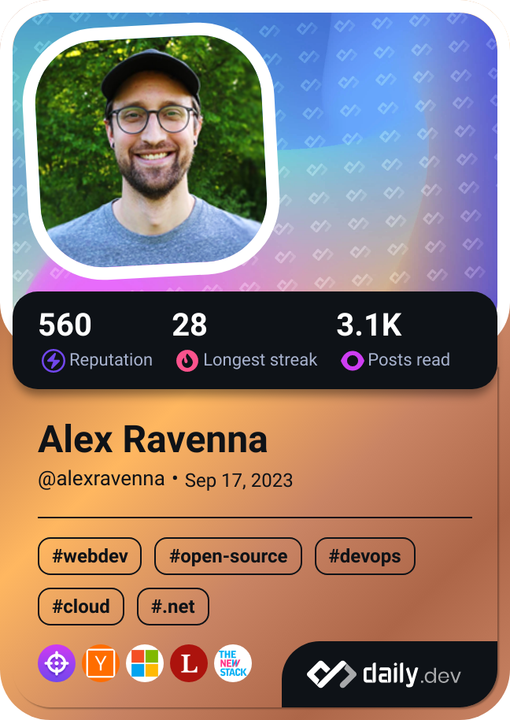

# Hi! I'm Alex 👋

🇺🇸 ✈️ 🇩🇪

I'm passionate about all aspects of software development and am fascinated by all the possibilities it creates.

I'm particularly interested in improving the developer experience (DX): documentation, automations, tools and tool integrations. I also believe in the open sharing of knowledge and that learning is a life-long journey. 

